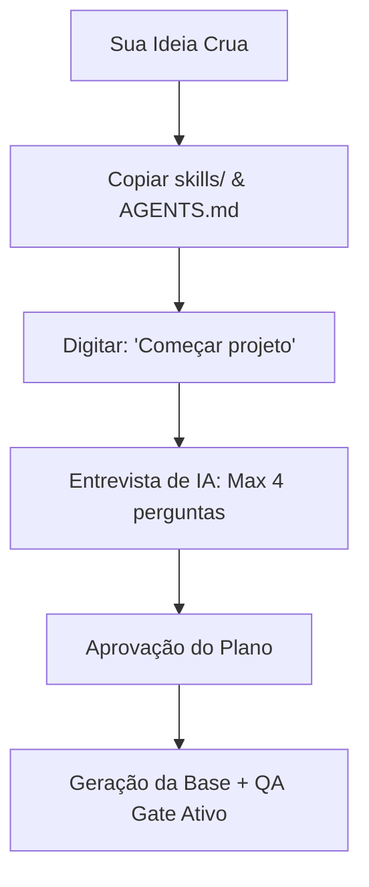

# 🚀 STARTER

<p align="center">
  <strong>O ponto de partida inteligente para novos projetos orientados a agentes de IA.</strong><br>
  Uma estrutura leve, autogerenciada e focada em eliminar a fricção inicial do desenvolvimento.
</p>

<p align="center">
  
  
  
</p>

---

## ⚡ A Promessa
**Você entra com uma ideia crua. O agente devolve direção clara, estrutura limpa e código pronto.**

Esqueça o tempo gasto configurando ambientes, limpando templates pesados ou decidindo arquiteturas sozinho. Com o **STARTER**, o agente conduz você por uma entrevista de até 4 perguntas simples e gera um setup sob medida com portaria de qualidade rigorosa integrada.

---

## 🎯 Como Funciona em 60 Segundos

Apenas 2 arquivos de infraestrutura inicial e 1 comando no chat.



### O Caminho Principal:
1. Crie ou abra a pasta vazia do seu novo projeto.
2. Copie a pasta `skills/` e o arquivo `AGENTS.md` para dentro dela.
3. No chat do seu editor favorito (Cursor, Claude Code, Antigravity, etc.), digite:
   ```bash
   Começar projeto
   ```
4. Responda às perguntas simples do agente, revise o plano gerado e confirme!

---

## ✨ O que você ganha vs. O que o STARTER evita

| 🎁 O que você ganha | 🚫 O que você nunca mais faz |
| :--- | :--- |
| **Kickoff guiado em minutos** sem paralisia de decisão | ❌ Configurar boilerplate manualmente |
| **Arquitetura modular e limpa** (Next.js, Vite, etc.) | ❌ Limpar arquivos inúteis de templates |
| **QA Gate integrado** (Validação automática de build/lint) | ❌ Subir código quebrado ou sem testes básicos |
| **UX & UI Standards aplicados** (Design Tokens, Acessibilidade) | ❌ Hardcodar estilos e cores sem semântica |

---

## 🗺️ Escolha seu Ponto de Partida

Durante o onboarding interativo, você pode guiar o agente para gerar qualquer um dos perfis abaixo:

*   **🌐 Landing Page (LP)**  
    *Foco:* Páginas de produto, validação de mercado, conversão rápida e estética premium com animações.
*   **📊 SaaS Dashboard**  
    *Foco:* Área logada, visualização de métricas, tabelas de dados dinâmicos, rotas seguras e gerenciamento de estado.
*   **⚙️ App Interno (Backoffice)**  
    *Foco:* Painéis operacionais rápidos, CRUDs automatizados, facilidade de uso e layout eficiente.
*   **🎨 Design System**  
    *Foco:* Tokens de design semânticos, consistência de marca, componentes reutilizáveis e documentação acessível.
*   **🔌 Backend & API**  
    *Foco:* Serviços robustos, validação de dados rígida, rotas limpas, segurança e integração simples.

---

## 🛠️ Sob o Capô: O Runtime OS v5.1

O STARTER funciona como um sistema operacional conversacional de desenvolvimento. Ele se autogerencia através de uma arquitetura baseada em estados:

1. **`runtime/index.yaml`**: Ordem de inicialização e dependências ativas.
2. **`runtime/rules.yaml` & `runtime/context.yaml`**: Contexto quente que dita as diretrizes e regras globais do projeto.
3. **`validate.py`**: O guardião de integridade que impede que o agente modifique arquivos fora do escopo ou quebre o fluxo de governança.
4. **`QA Gate (qa-gate.skill)`**: Uma etapa de revisão cética pós-implementação que garante que o projeto compila e atende aos critérios acordados.

---

## 💻 Compatibilidade e Ecossistema

*   **Experiência Premium:** Cursor, Claude Code e Antigravity (leitura nativa de `AGENTS.md` e execução rápida).
*   **Compatível:** VSCode, Windsurf, Cline, Roo.
*   **Padrão de Stack:** Next.js + pnpm (ou React + Vite para SPAs rápidas).

---

> ### 🔒 Rastro de Segurança & Autoria
>
> Este framework é desenvolvido e mantido por **Wesley Alves**.
>
> 🔗 [Meu Portfólio](https://wesscrow.github.io/meu-portfolio/) · [LinkedIn](https://www.linkedin.com/in/wessalves/) · [Behance](https://www.behance.net/wesleyalves)
>
> *Qualquer reprodução, distribuição ou uso derivado do framework STARTER deve manter esta atribuição.*  
> **Última atualização:** 2026-06-08
