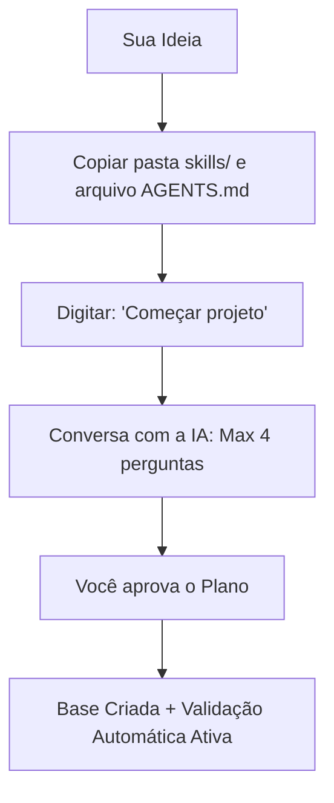

# STARTER

<p align="center">
  <strong>O ponto de partida organizado para criar projetos com agentes de IA.</strong><br>
  Uma estrutura leve, direto ao ponto e feita para eliminar a complicação inicial do desenvolvimento.
</p>

<p align="center">
  
  
  
  
</p>

---

## Proposta

**Você entra com uma ideia na cabeça. O STARTER organiza o caminho: kickoff guiado, contexto enxuto e validação antes de qualquer entrega.**

Esqueça o tempo perdido configurando pastas do zero ou limpando arquivos inúteis. O **STARTER** conduz você por uma conversa rápida de até 4 perguntas simples e gera um setup profissional sob medida. Ele organiza o contexto da IA para economizar seus tokens e fecha cada entrega com um QA Gate: o build precisa passar e o próprio agente faz uma revisão cética antes de marcar algo como pronto.

Quer entender o que o STARTER é (e o que ele não é)? Leia [O que é o STARTER](docs/public/O-QUE-E-O-STARTER.md).

---

## Como Funciona em Minutos

Apenas 2 arquivos de configuração e 1 comando no chat.



### Passo a Passo Simples:

1. Crie ou abra uma pasta vazia para o seu novo projeto.
2. Copie a pasta `skills/` e o arquivo `AGENTS.md` para dentro dela.
3. No chat do seu editor favorito (Cursor, Claude Code, Windsurf, etc.), digite:
   ```bash
   Começar projeto
   ```
4. Responda às perguntas simples da IA, revise o plano gerado e confirme!

---

## O que você ganha vs. O que o STARTER evita

| O que você ganha                                                                      | 🚫 O que você nunca mais faz                                                   |
| ------------------------------------------------------------------------------------ | ------------------------------------------------------------------------------ |
| **Contexto enxuto por design** — carrega só o necessário por sessão                   | ❌ Estourar o limite de uso da IA com arquivos repetitivos ou pesados          |
| **Sincronização entre editores** (Use Cursor, Claude Code, Cline sem perder o ritmo)  | ❌ Perder o histórico do projeto ou desconfigurar tudo ao trocar de IDE        |
| **Proteção de Segurança (Host Guard):** Bloqueio contra comandos perigosos            | ❌ Executar scripts perigosos por acidente ou vazar suas chaves `.env` no Git  |
| **Guia de Engenharia Completo:** Padrões limpos de Front, Back e Organização          | ❌ Escrever códigos confusos, com lentidão ou bagunçados                       |
| **Início guiado em minutos** diretamente pelo chat                                    | ❌ Perder horas escrevendo documentações ou planejamentos do zero              |
| **QA Gate em toda entrega** (build obrigatório + revisão cética do agente)            | ❌ Marcar uma feature como pronta sem o build passar                           |
| **Orquestração por tier de modelo** — economia via `AGENTS.md` §0g (Cursor delega automaticamente; Antigravity via protocolo) | ❌ Queimar tier caro em volume ou escolher subagent/modelo manualmente a cada tarefa |

---

## O que o QA Gate verifica (e o que não verifica)

Para você saber exatamente o que esperar:

- ✅ **Build (smoke):** `pnpm run build` precisa passar antes de qualquer entrega.
- ✅ **Revisão cética:** o agente audita a própria implementação contra o contrato da sprint e gera relatório em PT-BR.
- ✅ **Validação de estrutura:** scripts auditam os YAML do runtime, as skills e a higiene do repositório.
- ✅ **Testes E2E (Fase 4 Playwright):** ativos no modo CLI via `pnpm run test:e2e` (chromium). Geração automática de spec a partir do sprint-contract (`required_for_ui: true`). O passo final é sempre você testar 5 minutos no navegador.

---

## Escolha seu Ponto de Partida

Durante a conversa inicial, você pode guiar a IA para criar o modelo ideal para o seu objetivo:

- **Landing Page (LP):** Páginas de produto, validação rápida de mercado e visual premium com animações fluidas.
- **SaaS Dashboard:** Telas de login seguras, gráficos, tabelas dinâmicas e gerenciamento de dados simples (Zustand).
- **Painel Interno (Backoffice):** Painéis operacionais rápidos, criação/edição automática de dados e foco em eficiência.
- **Design System:** Componentes que podem ser reutilizados, identidade de marca visual organizada e acessibilidade nativa.
- **Backend & API:** Serviços robustos, validação de dados segura na entrada (Zod) e tratamento limpo de erros.

---

## Como Tudo Funciona por Trás dos Panos

O STARTER funciona como um manual de regras rígido e inteligente para a IA. Ele gerencia o fluxo para garantir estabilidade e gastar o mínimo de dinheiro possível através de 5 pilares:

1. **`runtime/index.yaml`**: Organiza a ordem exata em que as ferramentas do projeto devem ser ligadas.
2. **`runtime/rules.yaml` & `runtime/context.yaml`**: O conjunto de regras absolutas de segurança, código e arquitetura que a IA é obrigada a seguir.
3. **`validate.py`**: O guardião automatizado que audita a pasta, impedindo a IA de fazer bobagem ou expor senhas locais.
4. **`context-cleaner.skill`**: O faxineiro que limpa o histórico inútil para reduzir o desperdício de tokens.
5. **`QA Gate (qa-gate.skill)`**: A barreira de qualidade que roda o build e uma revisão cética antes de marcar a entrega como pronta.

---

## Compatibilidade

- **Experiência Recomendada:** Cursor, Claude Code e Antigravity (leitura nativa direta do arquivo `AGENTS.md`).
- **Compatível também:** VSCode, Windsurf, Cline, Roo.
- **Tecnologias Padrão:** Next.js + pnpm (ou React + Vite para páginas e aplicações ultra rápidas).

### Degradação graciosa por ambiente

O STARTER funciona em qualquer editor que leia `AGENTS.md`. Recursos automatizados (hooks, orquestração por tier) **degradam para convenção manual** onde o harness não os suporta — nada quebra, você só perde a automação. O que cada ambiente garante de fato:

| Editor / Harness | Lê `AGENTS.md` | Hook de sessão (§0f) | Orquestração por tier (§0g) |
|------------------|:--------------:|----------------------|------------------------------|
| **Cursor / Claude Code** | ✅ nativo | ✅ `SessionStart` automático | ✅ delega via Task/subagent |
| **Antigravity** | ✅ nativo | ⚠️ via protocolo (nova sessão) | ⚠️ fluxo auxiliar / nova sessão |
| **Cline / Roo** | ✅ leitura | ❌ sem hook → lê `AGENTS.md` | ✅ Plan/Architect → Act/Code (nativo) |
| **Windsurf / VSCode** | ✅ leitura | ❌ → lê `AGENTS.md` no início | ❌ single-session + `handoff.yaml` |

**Por sistema operacional:** macOS/Linux rodam os scripts `.sh` (validate, hooks, patch pnpm) nativamente — cobertura total. No **Windows**, os scripts exigem **WSL ou Git Bash**; sem eles, o framework continua válido por convenção (o agente lê `AGENTS.md` e segue os protocolos manualmente), apenas sem os scripts de hook/validação automáticos.

---

> ### Segurança & Autoria
>
> Este framework é open-source, desenvolvido e mantido por **Wesley Alves**.
>
> 🔗 [Meu Portfólio](https://wesscrow.github.io/meu-portfolio/) · [LinkedIn](https://www.linkedin.com/in/wessalves/) · [Behance](https://www.behance.net/wesleyalves)
>
> _Sinta-se livre para usar, estudar e evoluir a ferramenta! Apenas pedimos que mantenha os créditos originais do criador._
>
> **Última atualização:** 2026-06-13
