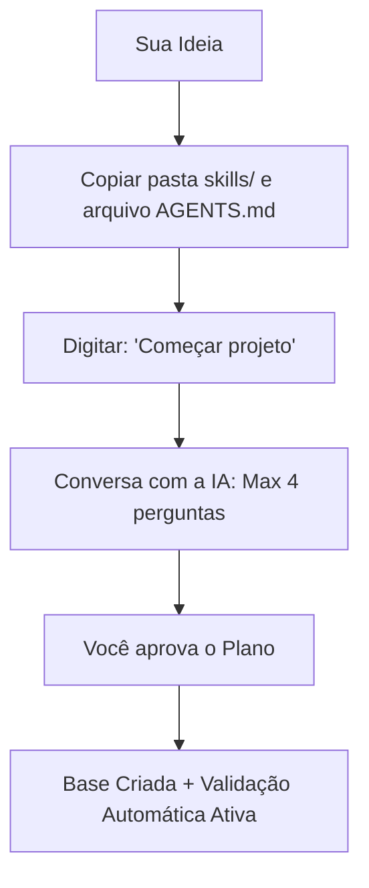

# STARTER

<p align="center">
  <strong>O ponto de partida inteligente para criar projetos com agentes de IA.</strong><br>
  Uma estrutura leve, direto ao ponto e feita para eliminar a complicação inicial do desenvolvimento.
</p>

<p align="center">
  
  
  
</p>

---

## Proposta

**Você entra com uma ideia na cabeça. O STARTER devolve o código pronto, limpo e testado — economizando seu bolso.**

Esqueça o tempo perdido configurando pastas do zero, limpando arquivos inúteis ou gastando fortunas com IA fora de controle. O **STARTER** conduz você por uma conversa rápida de até 4 perguntas simples e gera um setup profissional sob medida. Ele organiza o contexto da IA para economizar seus tokens e ativa um sistema automático que testa tudo para o código nunca quebrar.

---

## Como Funciona em Minutos

Apenas 2 arquivos de configuração e 1 comando no chat.



### Passo a Passo Simples:

1. Crie ou abra uma pasta vazia para o seu novo projeto.
2. Copie a pasta `skills/` e o arquivo `AGENTS.md` para dentro dela.
3. No chat do seu editor favorito (Cursor, Claude Code, Windsurf, etc.), digite:
   ```bash
   Começar projeto
   ```
4. Responda às perguntas simples da IA, revise o plano gerado e confirme!

---

## O que você ganha vs. O que o STARTER evita

| O que você ganha                                                                     | 🚫 O que você nunca mais faz                                                  |
| ------------------------------------------------------------------------------------ | ----------------------------------------------------------------------------- |
| **Contexto enxuto por design** — carrega só o necessário por sessão                      | ❌ Estourar o limite de uso da IA com arquivos repetitivos ou pesados         |
| **Sincronização entre editores** (Use Cursor, Claude Code, Cline sem perder o ritmo) | ❌ Perder o histórico do projeto ou desconfigurar tudo ao trocar de IDE       |
| **Proteção de Segurança (Host Guard):** Bloqueio contra comandos perigosos           | ❌ Executar scripts perigosos por acidente ou vazar suas chaves `.env` no Git |
| **Guia de Engenharia Completo:** Padrões limpos de Front, Back e Organização         | ❌ Escrever códigos confusos, com lentidão ou bagunçados                      |
| **Início guiado em minutos** diretamente pelo chat                                   | ❌ Perder horas escrevendo documentações ou planejamentos do zero             |
| **Validação automática de erros** (Sistema de QA integrado)                          | ❌ Subir código quebrado, com tela preta ou sem testes básicos                |

---

## Escolha seu Ponto de Partida

Durante a conversa inicial, você pode guiar a IA para criar o modelo ideal para o seu objetivo:

- **Landing Page (LP):** Páginas de produto, validação rápida de mercado e visual premium com animações fluidas.
- **SaaS Dashboard:** Telas de login seguras, gráficos, tabelas dinâmicas e gerenciamento de dados simples (Zustand).
- **Painel Interno (Backoffice):** Painéis operacionais rápidos, criação/edição automática de dados e foco em eficiência.
- **Design System:** Componentes que podem ser reutilizados, identidade de marca visual organizada e acessibilidade nativa.
- **Backend & API:** Serviços robustos, validação de dados segura na entrada (Zod) e tratamento limpo de erros.

---

## Como Tudo Funciona por Trás dos Panos

O STARTER funciona como um manual de regras rígido e inteligente para a IA. Ele gerencia o fluxo para garantir estabilidade e gastar o mínimo de dinheiro possível através de 5 pilares:

1. **`runtime/index.yaml`**: Organiza a ordem exata em que as ferramentas do projeto devem ser ligadas.
2. **`runtime/rules.yaml` & `runtime/context.yaml`**: O conjunto de regras absolutas de segurança, código e arquitetura que a IA é obrigada a seguir.
3. **`validate.py`**: O guardião automatizado que audita a pasta, impedindo a IA de fazer bobagem ou expor senhas locais.
4. **`context-cleaner.skill`**: O faxineiro que limpa o histórico inútil para reduzir drasticamente o desperdício de tokens.
5. **`QA Gate (qa-gate.skill)`**: A barreira final de qualidade que testa e garante que tudo compila perfeitamente antes de te entregar o código.

---

## Compatibilidade

- **Experiência Recomendada:** Cursor, Claude Code e Antigravity (leitura nativa direta do arquivo `AGENTS.md`).
- **Compatível também:** VSCode, Windsurf, Cline, Roo.
- **Tecnologias Padrão:** Next.js + pnpm (ou React + Vite para páginas e aplicações ultra rápidas).

---

> ### Segurança & Autoria
>
> Este framework é open-source, desenvolvido e mantido por **Wesley Alves**.
>
> 🔗 [Meu Portfólio](https://wesscrow.github.io/meu-portfolio/) · [LinkedIn](https://www.linkedin.com/in/wessalves/) · [Behance](https://www.behance.net/wesleyalves)
>
> _Sinta-se livre para usar, estudar e evoluir a ferramenta! Apenas pedimos que mantenha os créditos originais do criador._
>
> **Última atualização:** 2026-06-08
