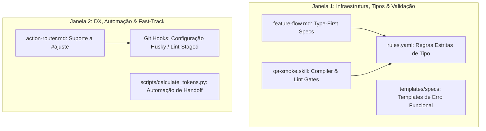

# plan.md — Plano Técnico de Engenharia (Boris Cherny Style)

> **Feature:** 009-refatoracao-boris
> **Projeto:** STARTER
> **Criado em:** 2026-06-19
> **Status:** rascunho
> **Protocolo:** `skills/flows/feature-flow.md`

---

## Proporcionalidade Arquitetural

*   **Nível:** `M` (Feature autocontida no framework; altera 4 arquivos de diretrizes/fluxos e adiciona 1 script utilitário).
*   **Decisões de Descarte:**
    *   *Descarte de CLI Rust/Go para cálculo de tokens:* Descartado devido à complexidade extra de compilar e distribuir binários para múltiplos SOs. Usaremos um script Python em `skills/scripts/calculate_tokens.py` aproveitando a existência do ambiente virtual `.venv` local e da biblioteca `tiktoken` ou um tokenizador aproximado de baixo overhead.
    *   *Descarte de biblioteca Either de terceiro:* Não usaremos pacotes adicionais do npm (como `fp-ts`) para o tratamento funcional de erros para evitar inchaço do node_modules dos projetos finais. Usaremos templates baseados em tipos nativos do TypeScript `{ ok: true, value: T } | { ok: false, error: E }`.

---

## Arquitetura da Feature

A implementação será distribuída em duas frentes de trabalho paralelas, cada uma operando em seu próprio escopo para permitir a execução paralela por agentes distintos.

---

## Detalhes de Implementação por Componente

### 1. Especificações Baseadas em Tipos (Type-First Specs)
*   **Onde:** [feature-flow.md](../../../../../skills/flows/feature-flow.md)
*   **O que muda:** 
    *   Na Fase 1 (Specify), se for um projeto TypeScript, instruir o agente a criar um arquivo `specs/NNN-nome/types.ts` ou declarar as assinaturas em código no início da especificação.
    *   Integrar a validação de tipos na Fase 5 (Analyze).

### 2. Compiler-Driven Gates e ESLint Estrito Nativos
*   **Onde:** [qa-smoke.skill](../../../../../skills/catalog/qa-smoke.skill) e [rules.yaml](../../../../../skills/core/runtime/rules.yaml)
*   **O que muda:**
    *   Em `qa-smoke.skill`, se for TypeScript, executar `tsc --noEmit` como passo obrigatório do build. Se o compilador falhar, o build falha.
    *   Em `rules.yaml`, sob `code`, adicionar `typescript: strict` e reforçar a proibição de `any` ou type assertion inseguro.

### 3. Automação do Cálculo de Tokens do Contexto
*   **Onde:** `skills/scripts/calculate_tokens.py` e `skills/core/runtime/handoff.yaml`
*   **O que muda:**
    *   Criar um script em Python que lê a estrutura do workspace, calcula a quantidade de tokens aproximada utilizando o tokenizer da OpenAI (via biblioteca `tiktoken` ou aproximação matemática baseada em contagem de caracteres por palavra se `tiktoken` não estiver instalado, mantendo robustez sem dependências duras) e grava diretamente no `handoff.yaml` sob a chave `context_metrics`.

### 4. Pipeline Simplificado de Ajustes (CI Local)
*   **Onde:** [action-router.md](../../../../../skills/flows/action-router.md)
*   **O que muda:**
    *   Adicionar tratamento para o sinal `#ajuste` no roteador, pulando a criação e a validação do `spec.md`/`plan.md` e permitindo a modificação direta com validação no `qa-smoke` local.

### 5. Tratamento de Exceções Baseado em Tipagem Funcional
*   **Onde:** `skills/templates/specs/`
*   **O que muda:**
    *   Criar um template `result.ts` contendo as definições reutilizáveis do tipo `Result<T, E>`.
    *   Adicionar diretrizes no `rules.yaml` sob `code.always: [functional_error_handling]`.

---

## Riscos & Mitigações

*   **Risco 1 (Dependência de Pacotes Python):** A biblioteca `tiktoken` pode não estar instalada no ambiente global ou no `.venv`.
    *   *Mitigação:* O script `calculate_tokens.py` deve ter um *fallback* robusto baseado na fórmula matemática `1 token ≈ 4 caracteres` ou contagem de palavras se o import falhar, garantindo que a execução nunca quebre.
*   **Risco 2 (Rigidez excessiva do compiler-gate):** Projetos com erros de tipagem pré-existentes na base de código do usuário podem travar o agente para sempre.
    *   *Mitigação:* O comando `tsc --noEmit` deve focar nos arquivos modificados na feature (se aplicável via git diff) ou lançar um aviso claro sugerindo o isolamento da tipagem.

---

> Parte do framework **STARTER** — criado e mantido por **Wesley Alves**.
> Última atualização: 2026-06-19
