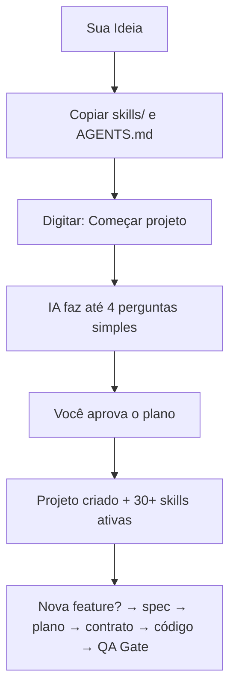

<!-- lp-github.md = espelho do README.md (fonte). Sincronizar a cada edição do README (ajustar link relativo de O-QUE-E-O-STARTER). Sprint 002 · P0.2+P1.7 -->

# STARTER

<p align="center">
  <strong>Um agente especializado em design engineering e desenvolvimento — com kickoff guiado, fluxo com contrato e QA gate em toda entrega.</strong>
</p>

<p align="center">
  
  
  
  
</p>

---

## Proposta

**Você cola dois arquivos na pasta, diz "Começar projeto" e o agente conduz o kickoff, escolhe a stack, configura o projeto e ativa um arsenal de 30+ skills especializadas em UI, design, Figma, produto e front-end.**

Cada feature nova segue um fluxo com especificação, plano e contrato aprovado — antes de qualquer linha de código. Cada entrega passa por um QA Gate: build obrigatório e revisão cética do agente.

Quer entender o que o STARTER é (e o que ele não é)? Leia [O que é o STARTER](O-QUE-E-O-STARTER.md).

---

## Como Funciona em 3 Passos



1. Crie ou abra uma pasta vazia para o seu projeto.
2. Copie a pasta `skills/` e o arquivo `AGENTS.md` para dentro dela.
3. No chat do seu editor favorito (Cursor, Claude Code, Windsurf etc.), digite:
   ```
   Começar projeto
   ```

O agente faz até 4 perguntas simples, resume o que vai criar e pede sua aprovação. Só então começa.

---

## O que você ganha vs. O que o STARTER evita

| O que você ganha | 🚫 O que você nunca mais faz |
|------------------|------------------------------|
| **30+ skills especializadas** ativas desde o kickoff — UI, Figma, produto, motion, landing | ❌ Reexplicar o mesmo contexto de design para a IA a cada sessão |
| **Fluxo spec-driven para features:** spec → plano → contrato aprovado → código | ❌ Receber código que muda o escopo ou quebra o que existia |
| **Contexto enxuto por design** — hot/warm/cold, só carrega o que a sessão precisa | ❌ Estourar o limite de tokens com arquivos inúteis abertos |
| **Sincronização entre editores** — Cursor, Claude Code, Cline sem perder o ritmo | ❌ Perder o histórico ao trocar de IDE ou reiniciar uma sessão |
| **Host Guard:** bloqueio contra comandos destrutivos e vazamento de `.env` | ❌ Executar scripts perigosos por acidente |
| **QA Gate em toda entrega** — build obrigatório + revisão cética do agente | ❌ Marcar uma feature como pronta sem o build passar |
| **Padrões de código invioláveis** — Front, Back, Arquitetura, Acessibilidade | ❌ Código com hardcode, `any`, `console.log` ou semântica quebrada |

---

## 30+ Skills Especializadas — ativas desde o kickoff

O STARTER não é só estrutura. Ele vem com um catálogo de skills que o agente aciona conforme a intenção da sua tarefa:

| Domínio | Skills disponíveis |
|---------|-------------------|
| **UI & Craft visual** | `interface-design` · `aw-designer` · `emil-design-eng` · `visual-direction-brief` · `web-design-cloner` |
| **Motion & Responsividade** | `fluid-ui` · `scroll-animation` · `responsive-craft` |
| **Figma** | `figma-implement-design` · `figma-foundation-docs` · `figma-make` |
| **Discovery & Produto** | `ux-diamond` · `ux-audit` · `product-vision` · `hypothesis-investigation` |
| **Conversão & Narrativa** | `landing-conversion` · `portfolio-storytelling` · `storyboard-cinematic` |
| **Vídeo & Motion HTML** | `hyperframes` · `hyperframes-cli` · `hyperframes-media` |
| **Governança & QA** | `qa-gate` · `qa-smoke` · `verify-before-done` · `session-review` · `context-cleaner` |
| **Prompts & Curadoria** | `prompt-library` · `marketplace-curator` |

O agente escolhe a skill certa para cada tarefa. Você não precisa memorizar nada.

---

## Fluxo para Features: Spec-Driven

Projeto em andamento? Cada nova feature segue um fluxo que impede surpresas:

```
Pedido → spec.md (o quê + por quê) → clarify (≤5 perguntas)
       → plan.md (como) → tasks.md → analyze → contrato aprovado → código → QA Gate
```

**HARD-GATE:** sem uma linha de código antes do contrato aprovado por você. Mesmo em features "simples". O agente não improvisa escopo.

---

## O que o QA Gate verifica (e o que não verifica)

- ✅ **Build (smoke):** `pnpm run build` precisa passar antes de qualquer entrega.
- ✅ **Revisão cética:** o agente audita a própria implementação contra o contrato da sprint e gera relatório em PT-BR.
- ✅ **Validação de estrutura:** scripts auditam os YAML do runtime, as skills e a higiene do repositório.
- ✅ **Testes E2E (Fase 4 Playwright):** ativos no modo CLI via `pnpm run test:e2e` (chromium). Geração automática de spec a partir do sprint-contract (`required_for_ui: true`). O passo final é sempre você testar 5 minutos no navegador.

---

## O que o Agente Sabe Criar

Durante o kickoff ou ao pedir nova feature, você pode direcionar para qualquer uma dessas entregas:

- **Landing de conversão** — copy por bloco, UX orientado a resultado, visual premium
- **UI experimental / Awwwards** — conceito radical, tokens, motion WOW, handoff dev
- **SaaS Dashboard** — login, gráficos, tabelas dinâmicas, Zustand
- **Design System** — tokens, variáveis Figma, componentes reutilizáveis, acessibilidade
- **Portfólio / Case** — narrativa profissional orientada a conversão
- **Backend & API** — validação Zod, sanitização de erros, arquitetura SOLID
- **Composição de vídeo em HTML** — motion graphics, captions, cenas via HyperFrames

---

## Como o Sistema Funciona por Trás

O STARTER opera em 4 camadas que garantem consistência entre sessões:

1. **Runtime YAML** (`runtime/index.yaml`): define o que carregar em cada fase — hot (sempre), warm (se feature ativa), cold (sob demanda). A IA não carrega o que não precisa.
2. **Skill routing** (`flows/Start.md`): mapeia intenção → skill certa. O agente não chuta qual habilidade usar.
3. **Spec-driven flow** (`flows/feature-flow.md`): toda feature passa por especificação, plano e contrato antes de virar código.
4. **QA Gate** (`qa-gate.skill` + `qa-smoke.skill`): build + revisão cética obrigatórios antes de qualquer entrega.

---

## Compatibilidade

- **Experiência recomendada:** Cursor, Claude Code e Antigravity (leitura nativa do `AGENTS.md`).
- **Compatível:** VSCode, Windsurf, Cline, Roo.
- **Stack padrão:** Next.js + pnpm (ou React + Vite para SPAs e protótipos).

---

> ### Segurança & Autoria
>
> Este framework é open-source, desenvolvido e mantido por **Wesley Alves**.
>
> 🔗 [Meu Portfólio](https://wesscrow.github.io/meu-portfolio/) · [LinkedIn](https://www.linkedin.com/in/wessalves/) · [Behance](https://www.behance.net/wesleyalves)
>
> _Sinta-se livre para usar, estudar e evoluir a ferramenta! Apenas pedimos que mantenha os créditos originais do criador._
>
> **Última atualização:** 2026-06-11
